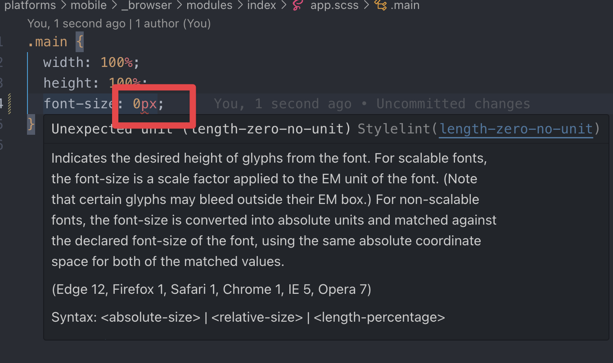

import Tabs from '@theme/Tabs';
import TabItem from '@theme/TabItem';

# Getting Started

## 快速开始

如果你已经熟悉前端开发环境，可以快速开始：

1. **环境要求**：`Git >= v2.39`、`Node >= v22.x`

2. **创建项目**：

```sh
bunx create-esboot
# 或
pnpm dlx create-esboot@latest
```

3. **启动项目**：

```sh
bun run dev
# 或
pnpm run dev
```

更多详细配置和说明请继续阅读下面的章节。

## 环境准备

### Git

- `Git >= v2.39`

#### 换行符配置

`ESBoot` 默认使用 `LF` 换行符。为了确保跨平台协作的一致性，建议配置 Git 使用 `LF` 换行符：

```sh
# 提交检出均不转换，统一使用LF
git config --global core.autocrlf false

# 拒绝提交包含混合换行符的文件
git config --global core.safecrlf true
```

:::warning 注意

上面的配置只对设置之后 clone 的项目有效，现有的项目是无效的，最好手动重新 clone。

:::

:::note 关于换行符

跨平台协作开发时，不统一的换行符会对文件交换带来麻烦。在不同平台上，换行符发生改变时，Git 会认为整个文件被修改，这就造成没法 diff，不能正确反映本次的修改。

更多可以参考[Git 多平台换行符问题(LF or CRLF)](https://kuanghy.github.io/2017/03/19/git-lf-or-crlf)。

:::

### Node

- `Node >= v22.x`

推荐使用 [volta](https://volta.sh/) 管理 Node 版本。

### 包管理器

推荐使用 [pnpm](https://pnpm.io/)，你也可以使用 [bun](https://bun.sh/)。

## 编辑器准备

在 2025 年，编辑器一定得有 AI 功能了。

### Cursor

[Cursor](https://cursor.sh/) - Built to make you extraordinarily productive, Cursor is the best way to code with AI.

### 其他编辑器

- [Trae](https://traeide.com/) - AI 增强的代码编辑器
- [Zed](https://zed.dev/) - 高性能代码编辑器
- [Windsurf](https://windsurf.com/) - AI 驱动的 IDE
- [Visual Studio Code](https://code.visualstudio.com/) - 微软开发的代码编辑器

## Visual Studio Code 插件

因为 ESBoot 内置了 eslint、stylelint 规则，所以需要安装以下插件。

### 必备插件

#### ESBoot

[ESBoot](https://marketplace.visualstudio.com/items?itemName=moonlitusun.esboot) - ESBoot 配套插件，可以快速切换环境变量，方便查看当前环境有多少页面可以启动和快速指定页面启动。


觉得命令不好搜的可以自己绑定个快捷键，这样可以快速唤起切页面。


#### Stylelint

[Stylelint](https://marketplace.visualstudio.com/items?itemName=stylelint.vscode-stylelint) - 样式代码检测工具。下载之后需要配置一下能支持 scss 规则。


配置完之后检测一下，找一个 scss 文件，配置一个 0px，查看一下效果。



#### ESLint

[ESLint](https://marketplace.visualstudio.com/items?itemName=dbaeumer.vscode-eslint) - JavaScript/TypeScript 代码检测工具。安装完之后不需要额外的配置，直接找一个 tsx 文件测试一下即可。

#### Prettier

[Prettier - Code formatter](https://marketplace.visualstudio.com/items?itemName=esbenp.prettier-vscode) - 代码格式化工具。建议在 VS Code 设置中将格式化工具选择为 `Prettier`。

#### EditorConfig

[EditorConfig](https://marketplace.visualstudio.com/items?itemName=EditorConfig.EditorConfig) - 统一编辑器配置，保持代码风格一致。

#### CSS Peek (本地)

下载 [dz-web-css-peek](./assets/dz-web-vscode-css-peek-4.4.1.vsix)，执行：

```sh
code --install-extension ./dz-web-vscode-css-peek-4.4.1.vsix
```

即可支持项目中 `tsx` 中的 `styleName` 跳转到 scss 文件。更多文档直接看 [CSS Peek](https://marketplace.visualstudio.com/items?itemName=pranaygp.vscode-css-peek&ssr=false#overview)，此插件只是定制支持了 `styleName`。

效果如下：


#### Babel-plugin-react-css-modules-autocomplete

[babel-plugin-react-css-modules-autocomplete](https://marketplace.visualstudio.com/items?itemName=ryotamannari.babel-plugin-react-css-modules-autocomplete) - 搭配 CSS Peek 插件，自动补全 React CSS Modules 类名。

#### Tailwind CSS IntelliSense

[Tailwind CSS IntelliSense](https://marketplace.visualstudio.com/items?itemName=bradlc.vscode-tailwindcss) - Tailwind CSS 类名智能提示和自动补全。

#### Vitest

[Vitest](https://marketplace.visualstudio.com/items?itemName=ZixuanChen.vitest-explorer) - Vitest 测试框架的 VS Code 集成，方便运行和调试测试。

#### Image preview

预览 `import` 的图片。

### 推荐插件

#### Git History

[Git History](https://marketplace.visualstudio.com/items?itemName=donjayamanne.githistory) - 显示每一个文件/每一行的历史提交记录，方便查看历史提交。

#### ENV

[ENV](https://marketplace.cursorapi.com/items?itemName=IronGeek.vscode-env) - 支持 `.env` 文件语法高亮。

#### Filesize

[filesize](https://marketplace.cursorapi.com/items?itemName=mkxml.vscode-filesize) - 在编辑器中显示文件大小。

#### Import Cost

[Import Cost](https://marketplace.cursorapi.com/items?itemName=wix.vscode-import-cost) - 在编辑器中内联显示导入包的大小。

#### NPM intellisense

[Npm intellisense](https://marketplace.cursorapi.com/items?itemName=christian-kohler.npm-intellisense) - 自动补全 npm 包名。

#### SVG

[SVG](https://marketplace.visualstudio.com/items?itemName=jock.svg) - 预览 SVG 文件。

## 创建项目

### 方式一：⭐️ 从上游创建项目(推荐)

为了能够上游模版更新之后可以cherry-pick更改。

#### 初始化

```sh
pnpm create esboot --upstream --url 你的项目git地址

# 示例
pnpm create esboot --upstream --url https://git.dztec.net/teams/web-team/dz-web/esboot/esboot-react-mp.git
```

上面的命令执行完成之后，你的本地会有两个 `remote`：

```sh
$ git remote -v

origin  <你的项目git地址> (fetch)
origin  <你的项目git地址> (push)
upstream  [esboot-template-upstream-url] (fetch)
upstream  [esboot-template-upstream-url] (push)
```

三个分支：

```sh
$ git branch -a

* dev
  upstream
```

- `dev` - 你的开发分支
- `upstream` - 上游的 main 分支

#### 合并上游更新

当你需要合并上游更新的时候，只需要执行：

#### 拉取更新

```sh
git fetch upstream main
```

#### 合并上游更新到 upstream 分支

```sh
# 如果你有本地修改需要合并，使用这个命令(不推荐本地改上游分支内容)
git merge upstream/main

# 如果你没有本地修改，直接切换到上游最新
git reset --hard upstream/main
```

#### 合并上游更新到 dev 分支

```sh
git checkout dev

# 如果需要合并所有更新使用rebase，如果只合并某几个更新使用cherry-pick
git rebase upstream
```

### 方式二：从内置模版创建

先找个地方建个空目录：

```sh
mkdir myapp && cd myapp
```

通过官方工具创建项目（以下模式选一种即可，推荐 `bunx`）：

<Tabs>
  <TabItem value="pnpm" label="pnpm">
    ```sh
    pnpm dlx create-esboot@latest
    ```
  </TabItem>
  <TabItem value="bun" label="bun" default>
    ```sh
    bunx create-esboot
    ```
  </TabItem>
  <TabItem value="npm" label="npm">
    ```sh
    npx create-esboot@latest
    ```
  </TabItem>
</Tabs>

### 方式三：从自定义模版创建

你可以创建自己的模版项目，只要名字叫 `@dz-web/esboot-electron-template-<模版名称>` 即可。

```sh
# 从 @dz-web/esboot-electron-template 创建一个 electron 模板
pnpm create esboot --template electron
```

### 创建方式对比

| 方式 | 适用场景 | 优点 | 缺点 |
| --- | --- | --- | --- |
| 方式一：从上游创建 | 需要与上游模版保持同步的项目 | 可以 cherry-pick 上游更新 | 需要配置 Git remote |
| 方式二：从内置模版创建 | 快速开始新项目 | 简单快速，无需额外配置 | 无法直接同步上游更新 |
| 方式三：从自定义模版创建 | 有自定义模版需求 | 可以使用团队定制模版 | 需要先创建模版项目 |

### 参数选项

#### 方式一参数

| option       | description                                                                                   |
| ------------ | --------------------------------------------------------------------------------------------- |
| `--url`      | 必填，指定你的 git 仓库地址                                                                     |
| `--name`     | 可选，指定目录名称，如果不填，默认用项目名称                                                  |
| `--upstream` | 可选，上游的地址，默认 `<https://git.dztec.net/teams/web-team/dz-web/esboot/esboot-react-mp.git>` |
| `--branch`   | 可选，上游的分支，默认 `main`                                                                  |

#### 通用参数

使用 `create-esboot` 创建项目时，可用的参数如下：

| option         | description                |
| -------------- | -------------------------- |
| `--no-git`     | 创建项目，但不初始化 Git   |
| `--no-install` | 创建项目，但不自动安装依赖 |

## 项目操作

推荐使用 [bun run](https://bun.sh/docs/cli/run)。

### 启动项目

<Tabs>
  <TabItem value="pnpm" label="pnpm">
    ```sh
    pnpm run dev
    ```
  </TabItem>
  <TabItem value="bun" label="bun" default>
    ```sh
    bun run dev
    ```
  </TabItem>
</Tabs>

### 构建项目

<Tabs>
  <TabItem value="pnpm" label="pnpm">
    ```sh
    pnpm run build
    ```
  </TabItem>
  <TabItem value="bun" label="bun" default>
    ```sh
    bun run build
    ```
  </TabItem>
</Tabs>

### 预览项目

<Tabs>
  <TabItem value="pnpm" label="pnpm">
    ```sh
    pnpm run preview
    ```
  </TabItem>
  <TabItem value="bun" label="bun" default>
    ```sh
    bun run preview
    ```
  </TabItem>
</Tabs>
