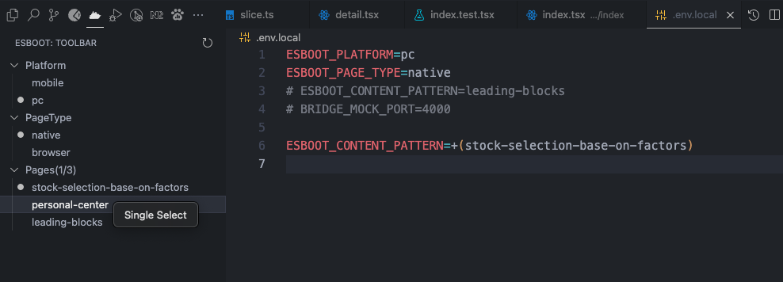
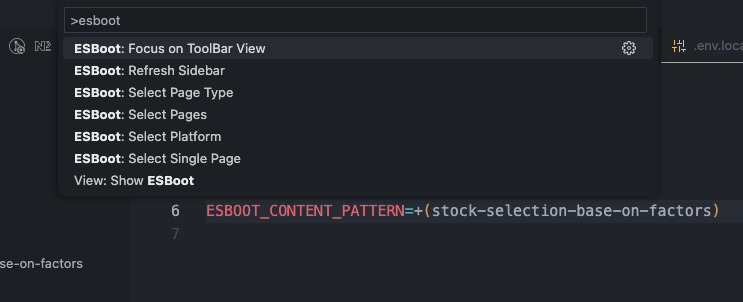
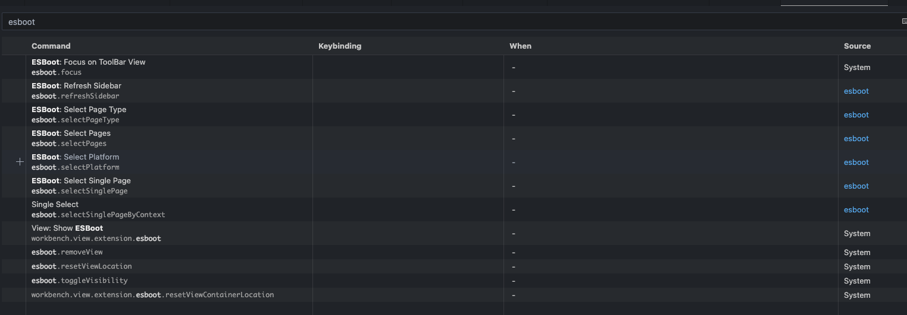
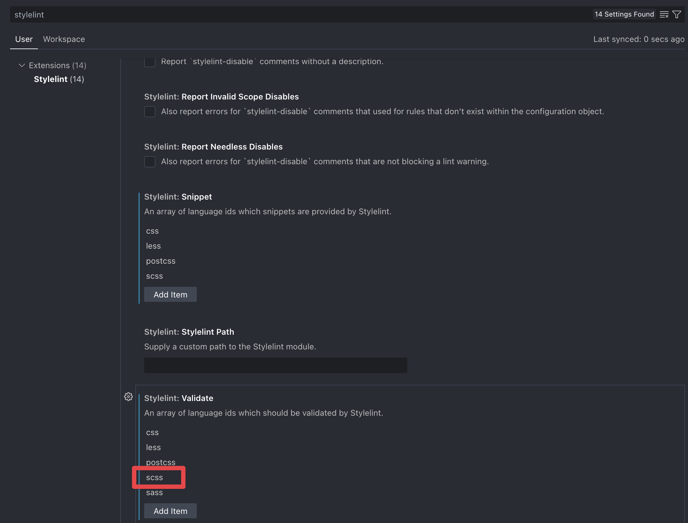
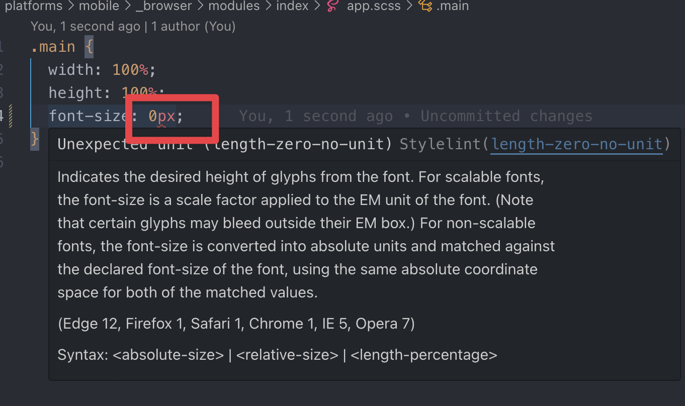

# Getting Started

## Quick Start

If you already have a standard frontend environment ready, the fastest path is:

1. **Requirements**: `Git >= v2.39`, `Node >= v22.x`
2. **Create a project**:

```sh
bunx create-esboot
# or
pnpm dlx create-esboot@latest
```

1. **Start development**:

```sh
bun run dev
# or
pnpm run dev
```

The following sections explain the environment, editor setup, and project creation workflow in more detail.

## Environment Setup

### Git

- `Git >= v2.39`

#### Line Ending Configuration

ESBoot uses `LF` line endings by default. For cross-platform collaboration, it is recommended to configure Git to keep `LF` consistently:

```sh
# Keep LF for both checkout and commit
git config --global core.autocrlf false

# Reject mixed line endings
git config --global core.safecrlf true
```

:::warning Note

These settings only affect repositories cloned after the configuration is applied. Existing clones are not retroactively fixed.

:::

### Node

- `Node >= v22.x`

We recommend using [volta](https://volta.sh/) to manage Node versions.

### Package Manager

[pnpm](https://pnpm.io/) is recommended. [bun](https://bun.sh/) also works.

## Editor Setup

In 2025, an editor should probably come with AI support.

### Cursor

[Cursor](https://cursor.sh/) - Built to make you extraordinarily productive, Cursor is one of the best ways to code with AI.

### Other Editors

- [Trae](https://traeide.com/) - AI-enhanced code editor
- [Zed](https://zed.dev/) - High-performance code editor
- [Windsurf](https://windsurf.com/) - AI-driven IDE
- [Visual Studio Code](https://code.visualstudio.com/) - Microsoft's code editor

## Visual Studio Code Extensions

Because ESBoot ships with built-in ESLint and Stylelint rules, the following extensions are recommended.

### Required Extensions

#### ESBoot

[ESBoot](https://marketplace.visualstudio.com/items?itemName=moonlitusun.esboot) - the companion extension for ESBoot. It helps switch environment files, inspect how many pages are available, and start a specific page quickly.





If you do not like searching commands manually, bind a shortcut key for faster page switching.



#### Stylelint

[Stylelint](https://marketplace.visualstudio.com/items?itemName=stylelint.vscode-stylelint) - style linting for CSS and SCSS.





#### ESLint

[ESLint](https://marketplace.visualstudio.com/items?itemName=dbaeumer.vscode-eslint) - JavaScript and TypeScript linting. No extra setup is usually required after installation.

#### Prettier

[Prettier - Code formatter](https://marketplace.visualstudio.com/items?itemName=esbenp.prettier-vscode) - choose `Prettier` as the default formatter in VS Code settings.

#### EditorConfig

[EditorConfig](https://marketplace.visualstudio.com/items?itemName=EditorConfig.EditorConfig) - keeps editor behavior aligned across contributors.

#### CSS Peek (local VSIX)

Install [dz-web-css-peek](./assets/dz-web-vscode-css-peek-4.4.1.vsix), then run:

```sh
code --install-extension ./dz-web-vscode-css-peek-4.4.1.vsix
```

This adds support for jumping from `styleName` usage in `tsx` files to the related scss file.


#### Babel-plugin-react-css-modules-autocomplete

[babel-plugin-react-css-modules-autocomplete](https://marketplace.visualstudio.com/items?itemName=ryotamannari.babel-plugin-react-css-modules-autocomplete) - auto-completes React CSS Modules class names, especially useful with CSS Peek.

#### Tailwind CSS IntelliSense

[Tailwind CSS IntelliSense](https://marketplace.visualstudio.com/items?itemName=bradlc.vscode-tailwindcss) - Tailwind class suggestions and completion.

#### Vitest

[Vitest](https://marketplace.visualstudio.com/items?itemName=ZixuanChen.vitest-explorer) - VS Code integration for running and debugging Vitest tests.

#### Image preview

Useful for previewing imported image assets.

### Recommended Extensions

- [Git History](https://marketplace.visualstudio.com/items?itemName=donjayamanne.githistory) - inspect file and line history quickly
- [ENV](https://marketplace.cursorapi.com/items?itemName=IronGeek.vscode-env) - syntax highlighting for `.env` files
- [filesize](https://marketplace.cursorapi.com/items?itemName=mkxml.vscode-filesize) - show file sizes in the editor
- [Import Cost](https://marketplace.cursorapi.com/items?itemName=wix.vscode-import-cost) - inline import size hints
- [NPM intellisense](https://marketplace.cursorapi.com/items?itemName=christian-kohler.npm-intellisense) - auto-complete npm package names
- [SVG](https://marketplace.visualstudio.com/items?itemName=jock.svg) - preview SVG files

## Create a Project

### Option 1: Create From Upstream Template

This is the recommended workflow if you want to keep cherry-picking updates from the upstream template later.

#### Initialize

```sh
pnpm create esboot --upstream --url <your-project-git-url>

# Example
pnpm create esboot --upstream --url https://git.dztec.net/teams/web-team/dz-web/esboot/esboot-react-mp.git
```

After that, your local repository will contain two remotes:

```sh
$ git remote -v

origin  <your-project-git-url> (fetch)
origin  <your-project-git-url> (push)
upstream  [esboot-template-upstream-url] (fetch)
upstream  [esboot-template-upstream-url] (push)
```

And at least these branches:

```sh
$ git branch -a

* dev
  upstream
```

- `dev`: your working branch
- `upstream`: tracks the upstream main branch

#### Sync Upstream Changes

```sh
git fetch upstream main
```

Then update the `upstream` branch:

```sh
# If you have local commits on upstream and want to merge them
git merge upstream/main

# If upstream is purely tracking and has no local changes
git reset --hard upstream/main
```

Finally, bring the upstream changes into `dev`:

```sh
git checkout dev
git rebase upstream
```

### Option 2: Create From Built-in Templates

Create an empty directory first:

```sh
mkdir myapp && cd myapp
```

Then run the create command and pick the built-in template you want.
