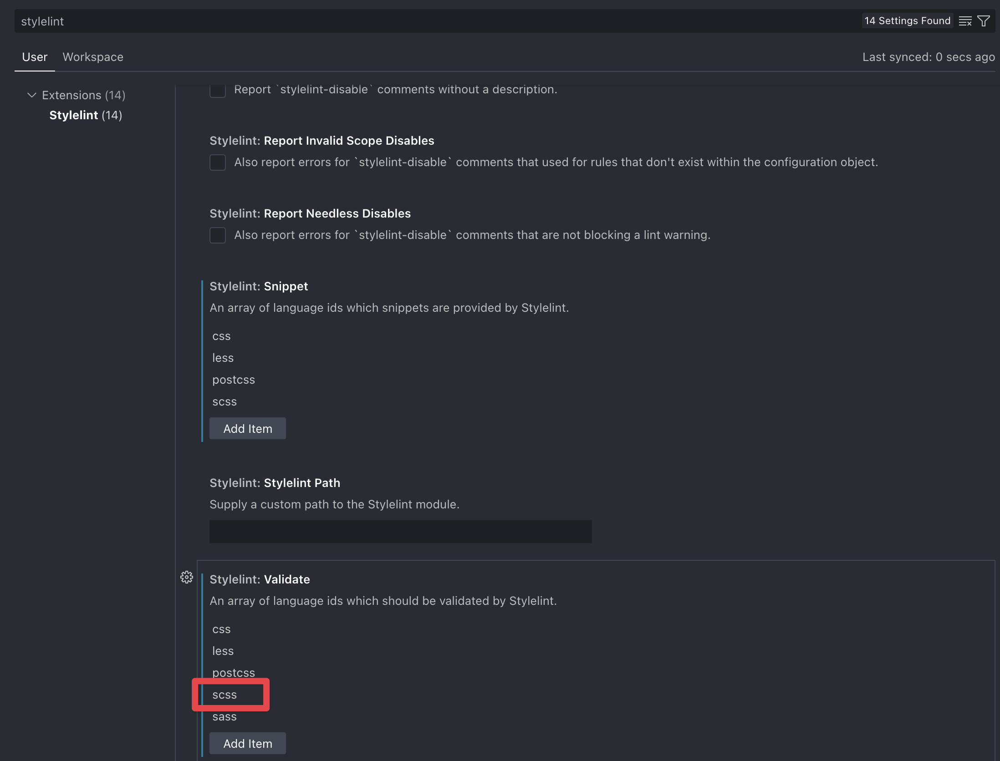

# 快速开始

## 环境准备

`Node >= v18.3`

ESBoot集成了很多工程化工具，包括一些Rust和Go的包，比较大，所以包管理工具推荐使用[pnpm](https://pnpm.io/)，节省磁盘空间，退而求次之选用[yarn1](https://classic.yarnpkg.com/en/docs)。

## 编辑器准备

推荐使用[Visual Studio Code](https://code.visualstudio.com/)，

## VSCode插件

因为ESBoot内置了eslint、stylelint规则。所以一定要安装以下插件

### Stylelint

- [Stylelint](https://marketplace.visualstudio.com/items?itemName=stylelint.vscode-stylelint)

stylelint下载之后需要配置一下能支持scss规则.



配置完之后检测一下，找一个scss文件，配置一个0px，查看一下效果。


### ESLint

- [ESLint](https://marketplace.visualstudio.com/items?itemName=dbaeumer.vscode-eslint)

安装完之后不需要额外的配置，直接找一个tsx文件测试一下即可。

### EditorConfig for VS Code

- [EditorConfig](https://marketplace.visualstudio.com/items?itemName=EditorConfig.EditorConfig)

### CSS Peek(local)

下载[dz-web-css-peek](./assets/dz-web-vscode-css-peek-4.4.1.vsix)，执行

```sh
code --install-extension ./dz-web-vscode-css-peek-4.4.1.vsix
```

即可支持项目中`tsx`中的`styleName`跳转到scss文件。

更多文档直接看[CSS Peek](https://marketplace.visualstudio.com/items?itemName=pranaygp.vscode-css-peek&ssr=false#overview)，此插件只是定制支持了`styleName`。

效果如下:


### babel-plugin-react-css-modules-autocomplete

搭配上面的插件，自动补全React CSS Modules类名。

### Image preview

预览`import`的图片。

## 创建项目

### 方式一：从官方内置模版创建

先找个地方建个空目录。

```bash
$ mkdir myapp && cd myapp
...
```

通过官方工具创建项目(以下模式选一种即可，推荐`bunx`)，

import Tabs from '@theme/Tabs';
import TabItem from '@theme/TabItem';

<Tabs>
  <TabItem value="pnpm" label="pnpm">
    ```sh
    pnpm dlx create-esboot@latest
    ```
  </TabItem>
  <TabItem value="bun" label="bun" default>
    ```sh
    bunx create-esboot
    ```
  </TabItem>
  <TabItem value="npm" label="npm">
    ```sh
    npx create-esboot@latest
    ```
  </TabItem>
  <TabItem value="yarn" label="yarn">
    ```sh
    yarn create esboot
    ```
  </TabItem>
</Tabs>

### 方式二：从自定义模版创建

```bash
# 从 @dz-web/esboot-electron-template 创建一个 electron 模板

pnpm create esboot --template electron
```

### 方式三：从上游创建项目

为了能够上游模版更新之后可以cherry-pick更改。

```sh
pnpm create esboot --upstream --url 你的项目git地址

# 示例
pnpm create esboot --upstream --url ssh://git@git.web.dz:10022/draft/esboot-react-mp-draft.git
```

#### 参数选项

可用的参数如下：

| option | description |
| ------ | ------ |
| `--url` | 必填，指定你的git仓库地址 |
| `--name` | 可选，指定目录名称，如果不填，默认用项目名称 |
| `--upstream` | 可选，上游的地址，默认`<http://git.web.dz/WebTeam/common-library/esboot/esboot-react-mp.git>` |
| `--branch` | 可选，上游的分支，默认`main` |

### 参数选项

使用 `create-esboot` 创建项目时，可用的参数如下：

| option | description |
| ------ | ------ |
| `--no-git` | 创建项目，但不初始化 Git |
| `--no-install` | 创建项目，但不自动安装依赖 |

## 启动项目

```bash
pnpm dev
```

## 构建项目

```bash
pnpm build
```
