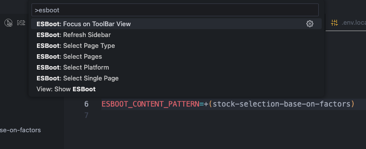

# Getting Started

## 环境准备

### Git

- `Git >= v2.39`。

- `Node >= v18.3`

#### 换行符

`ESBoot`默认使用`LF`换行符，如果你的Git环境不支持`LF`，先配置Git使用`LF`换行符。

:::note 关于换行符
UNIX/Linux 使用的是 0x0A（LF），早期的 Mac OS 使用的是 0x0D（CR），后来的 OS X 在更换内核后与 UNIX 保持一致了。但 DOS/Windows 一直使用 0x0D0A（CRLF） 作为换行符。
:::

跨平台协作开发是常有的，不统一的换行符会对跨平台的文件交换带来了麻烦。最大的问题是，在不同平台上，换行符发生改变时，Git 会认为整个文件被修改，这就造成没法 diff，不能正确反映本次的修改。

还好 Git 在设计时就考虑了这一点，其提供了一个 autocrlf 的配置项，用于在提交和检出时自动转换换行符。

```sh
# 提交检出均不转换，统一使用LF
git config --global core.autocrlf false

# 拒绝提交包含混合换行符的文件
git config --global core.safecrlf true
```

更多可以参考[Git 多平台换行符问题(LF or CRLF)](https://kuanghy.github.io/2017/03/19/git-lf-or-crlf)。

:::warning 注意

上面的配置只对设置之后 clone的项目有效，现有的项目是无效的，最好手动重新clone。

:::

### Node

`Node >= v18`。

推荐使用[volta](https://volta.sh/)管理Node版本。

### 包管理工具

推荐使用[pnpm](https://pnpm.io/)。

## 编辑器准备

### Cursor

[Cursor](https://cursor.sh/)

Built to make you extraordinarily productive, Cursor is the best way to code with AI.

### Visual Studio Code

[Visual Studio Code](https://code.visualstudio.com/)

## Visual Studio Code必备插件

因为ESBoot内置了eslint、stylelint规则。所以一定要安装以下插件

### ESBoot

- [ESBoot](https://marketplace.visualstudio.com/items?itemName=moonlitusun.esboot)

ESBoot配套插件，可以快速切环境变量。

特别是可以方便看到当前环境有多少页面可以启动和快速指定页面启动。




觉得命令不好搜的 可以自己绑定个快捷键 这样可以快速唤起 切页面。


### Stylelint

- [Stylelint](https://marketplace.visualstudio.com/items?itemName=stylelint.vscode-stylelint)

stylelint下载之后需要配置一下能支持scss规则.


配置完之后检测一下，找一个scss文件，配置一个0px，查看一下效果。


### ESLint

- [ESLint](https://marketplace.visualstudio.com/items?itemName=dbaeumer.vscode-eslint)

安装完之后不需要额外的配置，直接找一个tsx文件测试一下即可。

### Prettier

- [Prettier - Code formatter](https://marketplace.visualstudio.com/items?itemName=esbenp.prettier-vscode)

### EditorConfig for VS Code

- [EditorConfig](https://marketplace.visualstudio.com/items?itemName=EditorConfig.EditorConfig)

### CSS Peek(local)

下载[dz-web-css-peek](./assets/dz-web-vscode-css-peek-4.4.1.vsix)，执行

```sh
code --install-extension ./dz-web-vscode-css-peek-4.4.1.vsix
```

即可支持项目中`tsx`中的`styleName`跳转到scss文件。

更多文档直接看[CSS Peek](https://marketplace.visualstudio.com/items?itemName=pranaygp.vscode-css-peek&ssr=false#overview)，此插件只是定制支持了`styleName`。

效果如下:


### Babel-plugin-react-css-modules-autocomplete

- [babel-plugin-react-css-modules-autocomplete](https://marketplace.visualstudio.com/items?itemName=ryotamannari.babel-plugin-react-css-modules-autocomplete)

搭配上面的插件，自动补全React CSS Modules类名。

### Tailwind CSS IntelliSense

- [Tailwind CSS IntelliSense](https://marketplace.visualstudio.com/items?itemName=bradlc.vscode-tailwindcss)

### Vitest

- [Vitest](https://marketplace.visualstudio.com/items?itemName=ZixuanChen.vitest-explorer)

### Image preview

预览`import`的图片。

## Visual Studio Code推荐插件

### Git History

[Git History](https://marketplace.visualstudio.com/items?itemName=donjayamanne.githistory)

显示每一个文件/每一行的历史提交记录，方便查看历史提交。

### ENV

[ENV](https://marketplace.cursorapi.com/items?itemName=IronGeek.vscode-env)

支持`.env`高亮。

### Filesize

[filesize](https://marketplace.cursorapi.com/items?itemName=mkxml.vscode-filesize)

显示文件大小。

### Import Cost

[Import Cost](https://marketplace.cursorapi.com/items?itemName=wix.vscode-import-cost)

Display inline in the editor the size of the imported package。

### NPM intellisense

[Npm intellisense](https://marketplace.cursorapi.com/items?itemName=christian-kohler.npm-intellisense)

### SVG

[SVG](https://marketplace.visualstudio.com/items?itemName=jock.svg)

预览svg。

## Visual Studio Code配置

- 格式化工具选择`Prettier`

## 创建项目

### 方式一：⭐️ 从上游创建项目(推荐)

为了能够上游模版更新之后可以cherry-pick更改。

#### 初始化

```sh
pnpm create esboot --upstream --url 你的项目git地址

# 示例
pnpm create esboot --upstream --url ssh://git@git.web.dz:10022/draft/esboot-react-mp-draft.git
```

上面的命令执行完成之后，你的本地会有两个`remote`:

```sh
$ git remote -v

origin  <你的项目git地址> (fetch)
origin  <你的项目git地址> (push)
upstream  ssh://git@git.web.dz:10022/WebTeam/common-library/esboot/esboot-react-mp.git (fetch)
upstream  ssh://git@git.web.dz:10022/WebTeam/common-library/esboot/esboot-react-mp.git (push)
```

3个分支

```sh
$ git branch -a

* dev
  main
  upstream
  remotes/origin/HEAD -> origin/main
  remotes/origin/dev
  remotes/origin/main
  remotes/origin/upstream
  remotes/upstream/main
```

- `dev` 为你的开发分支
- `main` 为上游的开发分支
- `upstream` 为上游的main分支

#### 合并上游更新

当你需要合并上游更新的时候，只需要执行

**拉取更新**

```sh
git fetch upstream main
```

**合并上游更新到upstream分支**

```sh
# 如果你有本地修改需要合并，使用这个命令(不推荐本地改上游分支内容)
git merge upstream/main

# 如果你没有本地修改，直接切换到上游最新
git reset --hard upstream/main
```

**合并上游更新到dev分支**

```sh
git checkout dev

# 如果需要合并所有更新使用rebase，如果只合并某几个更新使用cherry-pick
git rebase upstream
```

### 方式二：从内置模版创建

先找个地方建个空目录。

```bash
$ mkdir myapp && cd myapp
...
```

通过官方工具创建项目(以下模式选一种即可，推荐`bunx`)，

import Tabs from '@theme/Tabs';
import TabItem from '@theme/TabItem';

<Tabs>
  <TabItem value="pnpm" label="pnpm">
    ```sh
    pnpm dlx create-esboot@3
    ```
  </TabItem>
  <TabItem value="bun" label="bun" default>
    ```sh
    bunx create-esboot@3
    ```
  </TabItem>
  <TabItem value="npm" label="npm">
    ```sh
    npx create-esboot@3
    ```
  </TabItem>
</Tabs>

### 方式三：从自定义模版创建

你可以创建自己的模版项目，只要名字叫`@dz-web/esboot-electron-template-<模版名称>`即可。

```bash
# 从 @dz-web/esboot-electron-template 创建一个 electron 模板

pnpm create esboot --template electron
```

#### 参数选项

可用的参数如下：

| option       | description                                                                                   |
| ------------ | --------------------------------------------------------------------------------------------- |
| `--url`      | 必填，指定你的git仓库地址                                                                     |
| `--name`     | 可选，指定目录名称，如果不填，默认用项目名称                                                  |
| `--upstream` | 可选，上游的地址，默认`<http://git.web.dz/WebTeam/common-library/esboot/esboot-react-mp.git>` |
| `--branch`   | 可选，上游的分支，默认`main`                                                                  |

### 参数选项

使用 `create-esboot` 创建项目时，可用的参数如下：

| option         | description                |
| -------------- | -------------------------- |
| `--no-git`     | 创建项目，但不初始化 Git   |
| `--no-install` | 创建项目，但不自动安装依赖 |

## 启动项目

推荐使用 [bun run](https://bun.sh/docs/cli/run)

<Tabs>
  <TabItem value="pnpm" label="pnpm">
    ```sh
    pnpm run dev
    ```
  </TabItem>
  <TabItem value="bun" label="bun" default>
    ```sh
    bun run dev
    ```
  </TabItem>
</Tabs>

## 构建项目

<Tabs>
  <TabItem value="pnpm" label="pnpm">
    ```sh
    pnpm run build
    ```
  </TabItem>
  <TabItem value="bun" label="bun" default>
    ```sh
    bun run build
    ```
  </TabItem>
</Tabs>

## 预览项目

<Tabs>
  <TabItem value="pnpm" label="pnpm">
    ```sh
    pnpm run preview
    ```
  </TabItem>
  <TabItem value="bun" label="bun" default>
    ```sh
    bun run preview
    ```
  </TabItem>
</Tabs>